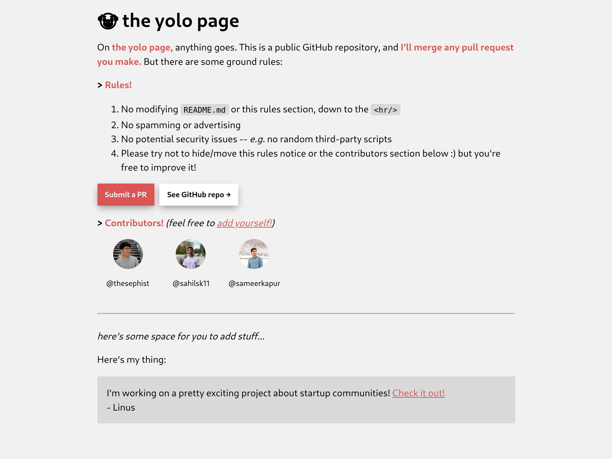

# 🤡 the yolo page

>I'll merge any pull request you make.
>What if I just made a github repo that autodeployed to one of my domains and I accepted every PR that came thru
>
>feel like it might be kinda fun
>
>- [@thesephist, Twitter](https://twitter.com/thesephist/status/1294105336731795456)

So, here we are. Presenting: **[the yolo page](https://thesephist.github.io/yolo/)**

On the yolo page, anything goes. This is a public GitHub repository, and I'll merge any pull request you make. But there are some ground rules:

> Rules!

1. No modifying README.md or this rules section, down to the 

1. No spamming or advertising
1. No potential security issues -- e.g. no random third-party scripts
1. Please try not to hide/move this rules notice or the contributors section below :) but you're free to improve it!

You can see much more on the actual site ^^

Here's what it's starting out as, on the morning of August 14, 2020:

